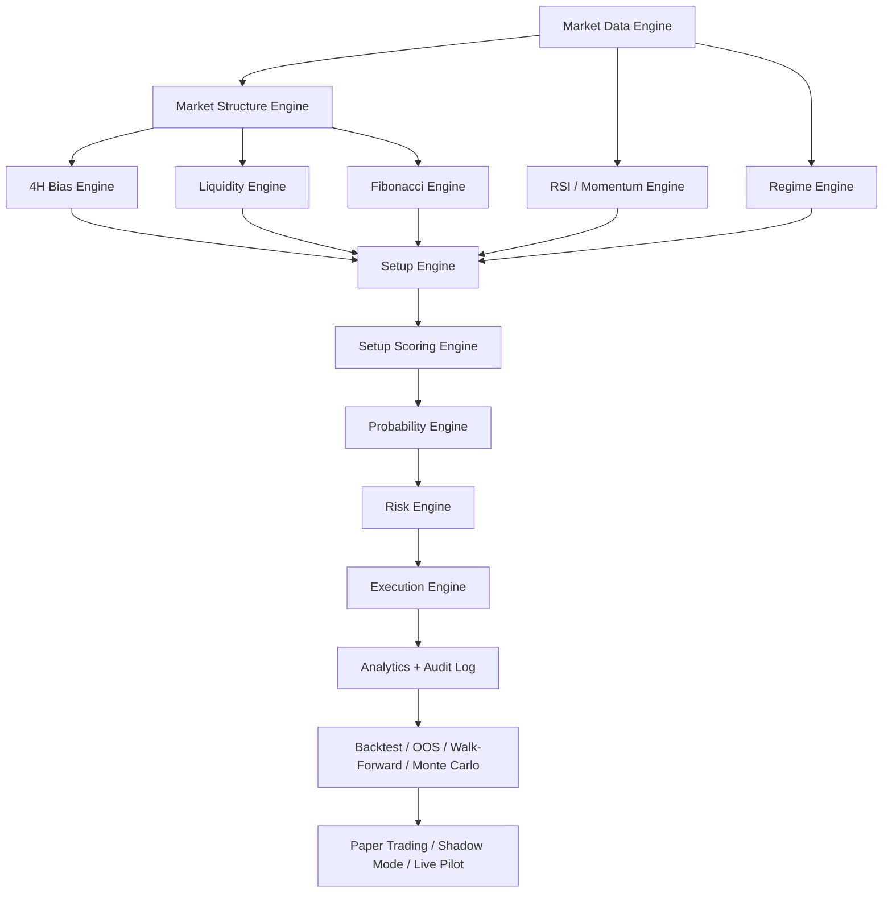

# WISE² TRADING Implementation Plan

Last updated: August 18, 2026

## Purpose

This document converts the WISE² TRADING master build brief into a concrete implementation plan for this repository.

It assumes:

- the core market thesis is preserved
- all parameters remain testable
- the 65% out-of-sample win-rate target is a gate, not a promise
- failure must be reported honestly when the edge does not survive validation

## Core Thesis

WISE² TRADING is built around one invariant:

`Liquidity Establishment -> Liquidity Raid -> Acceptance/Rejection -> Expansion`

Everything else is versioned, tested, and allowed to change.

## Platform Shape

The current repo foundation for this work lives in [packages/aether-trader](/Users/danielwise/Projects/wise2-core/packages/aether-trader), which already provides:

- deterministic setup generation
- backtesting
- walk-forward validation
- Monte Carlo validation
- performance-gate reporting

The next stage is to evolve that package into a full WISE² Trading subsystem without mixing fake and production data.

## Proposed Repo Layout

```text
packages/
  aether-trader/
    src/
      data/
      structure/
      liquidity/
      bias/
      fib/
      momentum/
      regimes/
      setups/
      scoring/
      probability/
      risk/
      execution/
      analytics/
      validation/
      reporting/
      audit/
      types/

apps/
  wise2-trading-command-center/
    app/
    components/
    lib/
    api/
```

## Engine Map



## Delivery Phases

### Phase 1: Research-Core Hardening

Goal:
Turn the existing research package into a trustworthy deterministic research engine.

Deliver:

- strict candle schema and market metadata
- no-lookahead event loop
- realistic tick-size and tick-value handling
- contract specification registry for MNQ, NQ, MES, ES
- reproducible backtest seeds
- parameter-set hashing
- immutable strategy version records

Exit criteria:

- same input data always yields identical trade logs
- performance report clearly marks pass/fail
- no simulated production values leak into production views

### Phase 2: Validation Framework

Goal:
Enforce the anti-curve-fit process described in the brief.

Deliver:

- train/validation/OOS segmentation
- walk-forward window runner
- Monte Carlo perturbation runner
- parameter-grid neighborhood testing
- suspicious-model flags
- composite model ranking

Exit criteria:

- untouched OOS remains isolated until model selection is complete
- every candidate strategy produces a validation packet
- unstable parameter spikes are automatically flagged

### Phase 3: Paper / Shadow Trading

Goal:
Connect live feeds without live capital risk.

Deliver:

- live market-data ingestion
- signal generation in real time
- hypothetical order simulation
- latency/slippage capture
- broker metadata checks
- shadow-mode reconciliation reports

Exit criteria:

- live signals are timestamped and auditable
- expected versus simulated fill quality is measurable
- no live capital routing is possible without explicit promotion

### Phase 4: Command Center

Goal:
Ship the premium WISE² Trading operator interface.

Deliver:

- overview
- market map
- setups
- research
- validation
- analytics
- risk
- execution

Exit criteria:

- when disconnected, UI shows `NOT CONNECTED` or `NO DATA`
- no fabricated P&L, fills, trades, or win rates
- kill-switch status is visible and authoritative

### Phase 5: Limited-Risk Production Pilot

Goal:
Allow tightly controlled real execution after research proof and human approval.

Deliver:

- broker adapter
- hard risk-limit enforcement
- promotion workflow
- operator approvals
- emergency kill switch
- immutable production audit trail

Exit criteria:

- no unversioned strategy can trade
- no hard risk rule can be overridden by strategy logic
- promotions require explicit admin approval

## Engine-Level Acceptance Rules

### Market Data Engine

Must provide:

- normalized OHLCV schema
- session normalization
- bad tick detection
- duplicate detection
- missing-bar detection
- continuous-contract and rollover awareness

Reject release if:

- bars can arrive unordered without detection
- timezone/session mapping is ambiguous
- rollover logic mutates historical records silently

### Market Structure / Bias / Liquidity

Must be:

- deterministic
- auditable
- volatility-aware
- instrument-agnostic

Reject release if:

- swing detection depends on manual interpretation
- sweep detection uses arbitrary fixed thresholds across all instruments
- 4H bias cannot explain why it is bullish, bearish, or neutral

### Setup / Scoring / Probability

Must support:

- candidate creation
- explicit rejection reasons
- versioned scoring weights
- leakage-safe features
- probability threshold validation

Reject release if:

- candidates cannot be reconstructed from stored features
- ML uses future information
- threshold tuning is done directly on OOS data

### Risk / Execution

Must enforce:

- percent risk sizing
- max daily loss
- max consecutive losses
- max open positions
- max drawdown shutdown
- correlation and leverage limits

Reject release if:

- any component can bypass hard risk locks
- live orders can be sent without strategy version, approval state, and audit context

## Data Model

Minimum production tables:

- `instruments`
- `candles`
- `sessions`
- `liquidity_levels`
- `market_structure`
- `fib_structures`
- `regimes`
- `candidate_setups`
- `setup_features`
- `probability_outputs`
- `orders`
- `fills`
- `positions`
- `trades`
- `risk_events`
- `strategy_versions`
- `experiments`
- `backtests`
- `walk_forward_runs`
- `monte_carlo_runs`
- `optimization_runs`
- `performance_metrics`
- `economic_events`
- `broker_connections`
- `system_events`
- `audit_logs`

Key rules:

- use migrations only
- store immutable version IDs
- attach data version + code commit + parameter hash to every experiment
- never mutate historical trade facts silently

## API Surface

Recommended services:

- `market-data`
- `market-structure`
- `liquidity`
- `bias`
- `fibonacci`
- `momentum`
- `regimes`
- `setups`
- `scoring`
- `probability`
- `risk`
- `execution`
- `analytics`
- `research`
- `validation`
- `settings`
- `system-health`

Guardrails:

- auth required
- role-based authorization
- broker credentials server-side only
- kill-switch actions require elevated permission and audit logging

## Strategy Promotion Workflow

```text
OBSERVE
-> GENERATE HYPOTHESIS
-> BUILD CANDIDATE
-> TRAIN
-> VALIDATE
-> OOS
-> WALK-FORWARD
-> MONTE CARLO
-> HUMAN APPROVAL
-> PAPER
-> SHADOW
-> LIMITED LIVE PILOT
-> PRODUCTION
```

No shortcut is allowed between research and production.

## Performance Gate

A candidate version is promotable only when all of the following are true:

- out-of-sample win rate is at least 65%
- expectancy is positive
- profit factor is positive and preferably at least 1.5
- drawdown remains within approved limits
- walk-forward performance is stable
- Monte Carlo risk is acceptable
- small parameter changes do not collapse the edge
- slippage/spread sensitivity is tolerable

If any gate fails:

- report the failure
- classify the bottleneck
- create a new candidate only after a fresh hypothesis

## Immediate Next Tasks

1. Split [packages/aether-trader/src](/Users/danielwise/Projects/wise2-core/packages/aether-trader/src) into engine folders that mirror the WISE² Trading brief.
2. Add immutable `strategy_version` and `experiment` types so every validation run is version-aware.
3. Introduce real instrument specs for MNQ, NQ, MES, and ES instead of generic tick assumptions.
4. Replace the demo-only sample feed path with explicit `development fixture` labeling and add a real CSV ingestion workflow.
5. Create the first database migration set for research artifacts and audit logs.
6. Stand up a command-center shell that defaults disconnected states to `NO DATA`.

## Non-Negotiables

- no fake production metrics
- no silent mixing of simulated and real data
- no direct jump from backtest to unrestricted live trading
- no claim of success when OOS validation fails
- no live execution from an unversioned strategy
