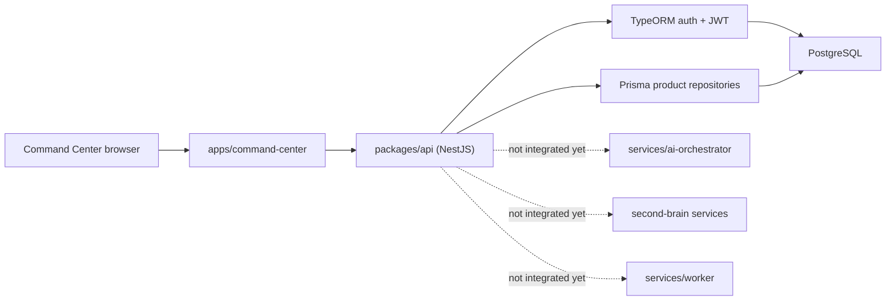

# Hermes Intelligence OS — Architecture Audit

Date: 2026-07-30

## Canonical runtime paths

| Concern | Canonical path | Current state |
| --- | --- | --- |
| Public product | `apps/website` | Production-facing Next.js application |
| Operator dashboard | `apps/command-center` | Active Next.js dashboard, authenticated through the core API |
| Core API | `packages/api` | Active NestJS API using TypeORM for auth and Prisma for product data |
| Product database schema | `packages/db/prisma/schema.prisma` | PostgreSQL schema used by Prisma services |
| Hermes agent prototype | `services/ai-orchestrator` | Separate TypeScript service; not installed as a root workspace package |
| Second Brain | `second-brain` | Separate sync/search/API services; not mounted in the active Nest app |
| Automation worker | `services/worker` | Redis-backed worker prototype |
| Legacy API | `services/api` | Express service with an unrelated in-memory “Hermes website builder” |

Recursive trees below `services/dashboard/services/dashboard/...` are not
canonical. They must not receive new product work.

## Live request path

## Evidence-backed findings

1. `packages/api/src/main.ts` mounts the global `/api` prefix. New Hermes routes
   therefore live under `/api/v1/hermes/*`.
2. Active JWT validation returns `id`, `email`, and `role`; it has no
   organization or workspace claim.
3. The active PostgreSQL `User` entity has no organization membership relation.
4. The older Mongo `brain-auth` schemas contain workspace IDs and permission
   guards, but `MongooseModule` and `BrainAuthModule` are disabled in
   `packages/api/src/app.module.ts`.
5. `Prospect` has no owner or tenant field. It cannot be safely included in a
   multi-tenant brief. `Customer.userId` is optional. Projects, Sound Labs,
   gallery assets, bookings, and consulting audits have a user-derived scope.
6. Command Center workspace APIs currently return hard-coded demo workspaces.
7. The AI orchestrator has model registry and routing prototypes, but it assumes
   local `localhost:11434`, has its own dependency install, and is not called by
   the active API.
8. The legacy Express Hermes route stores jobs in memory and represents a
   website builder, not the requested business intelligence agent.
9. Several API controllers are public because they do not use `JwtAuthGuard`.
   Tenant fields alone will not be sufficient until those routes are guarded.

## Baseline verification

| Check | Result |
| --- | --- |
| `pnpm --filter @wise2/api type-check` | Pass |
| `pnpm --filter @wise2/command-center type-check` | Pass |
| `pnpm --filter @wise2/api test -- --runInBand` | 61 tests pass; 6 suites fail to compile |
| AI orchestrator build | Blocked: local `node_modules` is absent and it is outside the root workspace |

The six failing suites are pre-existing: missing `supertest`, stale
`email_verified` assertions, and stale brain-auth test interfaces. Jest also
leaves an open handle after completing the runnable suites.

## Phase-one integration decision

The first vertical slice is implemented in the active Nest API:

- `GET /api/v1/hermes/brief/daily`
- `GET /api/v1/hermes/actions`
- `POST /api/v1/hermes/actions`
- `GET /api/v1/hermes/actions/:id`
- `POST /api/v1/hermes/actions/:id/approve`
- `POST /api/v1/hermes/actions/:id/reject`

Every route requires the active JWT guard. Until canonical organization
membership exists, the verified user ID is the tenant boundary. No caller may
submit or override that boundary. High- and critical-risk actions always require
human approval.

The Daily Brief uses only sources with a user-derived filter. Missing or
unavailable sources return `null` and a named access issue; they do not become
fabricated zeros. Prospect data is intentionally excluded until its schema has
a required tenant owner.

## Required next migrations

1. Create canonical `organizations`, `organization_members`, and
   `organization_invites` tables.
2. Add a required `organization_id` to Prospect, Customer, Project, Sound Labs,
   Gallery, Booking, Audit, Hermes, memory, model-usage, and automation records.
3. Add an active organization claim to access tokens and validate membership on
   every request.
4. Replace Command Center demo workspace routes with membership-filtered API
   routes.
5. Guard all customer/prospect/audit/project mutation routes and add
   cross-tenant tests.
6. Put model routing behind the core API and persist decisions, latency, token
   use, estimated cost, failure, and fallback reason.
7. Connect the worker through a durable queue and require approval state before
   high-risk execution.

No production deployment or migration should run until the migration has been
reviewed and an explicit deployment approval is given.
